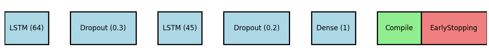
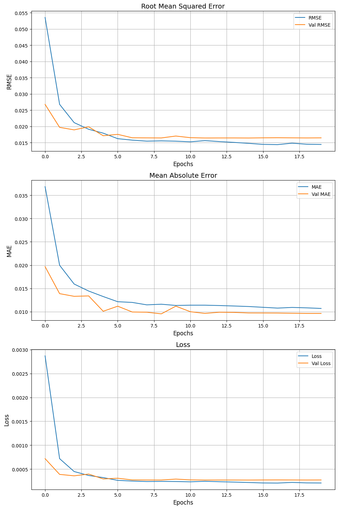

# <span style="color:#2c3e50"> LSTM Price Movement Predictions For Trading Algorithms</span>


Our aim is to predict daily returns to capture trends and assist individuals in making long-term investments. We experimented with multiple models and ultimately selected three, each documented in separate Jupyter notebooks. The final model is presented in Model 3, which includes detailed data analysis.

## <span style="color:#3498db">Table of Contents</span>
- [ LSTM Price Movement Predictions For Trading Algorithms](#-lstm-price-movement-predictions-for-tradingalgorithms)
  - [Table of Contents](#table-of-contents)
  - [Data](#data)
  - [Notebooks](#notebooks)
    - [Model 1](#model-1)
    - [Model 2](#model-2)
    - [Model 3 (Final Model)](#model-3-final-model)
  - [Usage](#usage)
  - [Team](#team)

<span style="color:#2ecc71">Project Overview</span>
The goal of this project is to predict the prices of the S&P 500 index. We explored various features and models to identify the most effective approach for accurate predictions. Throughout our analysis, we ensured that our models were unbiased, with predictions closely aligned with real values. Among the models tested, Linear Regression on Principal Components showed strong performance. However, recognizing the presence of intricate temporal patterns that simpler models couldn't capture, we ultimately chose a more advanced method, LSTM, to effectively model the data.

## <span style="color:#e67e22">Data</span>
The data used for this project consists of historical price information for the S&P 500 index. The dataset includes features such as:
- **Date**: The date of the recorded data.
- **Open**: The price of the S&P 500 at market open.
- **High**: The highest price of the S&P 500 on that day.
- **Low**: The lowest price of the S&P 500 on that day.
- **Close**: The closing price of the S&P 500.
- **Adj Close**: The adjusted closing price of the S&P 500, adjusted for dividends and splits.
- **Volume**: The number of shares traded.

The data was preprocessed to handle missing values and create new features that could potentially improve the prediction model. The data analysis and preprocessing steps are detailed in the notebooks.

Snippet of code of how the data is loaded in the notebooks:

```python
start = '2000-01-01'
end = datetime(2024, 8, 7, 11, 21, 24, 633194)

sp500_data = yf.download('^GSPC', start=start, end=end)
sp500 = sp500_data.dropna()
print(sp500.head(3))
```

For more details on the data collection and preprocessing, refer to the notebooks.

## <span style="color:#9b59b6">Notebooks</span>

### <span style="color:#e74c3c">Model 1</span>
- **Description**: This notebook focuses on using the 'Adj Close' feature for prediction.
- **Number of Code Cells**: 13

```python
model = Sequential()
model.add(LSTM(units=50, return_sequences=True, input_shape=(x_train.shape[1], 1)))
model.add(LSTM(units=50, return_sequences=False))
model.add(Dense(units=1))

# Compile the model
model.compile(optimizer='adam', loss='mean_squared_error')

history=model.fit(x_train,y_train,epochs=2,batch_size=2,validation_split=0.2)
```
[View Model 1 Notebook](./Project/Final%20folder/Model%201.ipynb)

### <span style="color:#f39c12">Model 2</span>
- **Description**: This notebook explores why predicting the 'Adj Close' price may not be the best approach.
- **Number of Code Cells**: 15

```python
# Code snippet of model 
model = Sequential()
model.add(LSTM(units=150, input_shape=(X_train.shape[1], X_train.shape[2])))
model.add(Dense(1))
model.add(Activation('linear', name='output'))

adam = optimizers.Adam()
model.compile(optimizer='adam', loss='mse', metrics=[tf.keras.metrics.RootMeanSquaredError()])

history = model.fit(x=X_train, y=y_train, epochs=30, batch_size=15, shuffle=True, validation_split=0.1)
```

[View Model 2 Notebook](./Project/Final%20folder/Model%202.ipynb)

### <span style="color:#2980b9">Model 3 (Final Model)</span>
- **Description**: This is our final model, which includes comprehensive data analysis and the finalized prediction model.
- **Number of Code Cells**: 29

Architecture of the final model in Model 3:
<!-- add image.png  -->


```python
# Code snippet of final model
model = Sequential([
    LSTM(units=64, return_sequences=True, input_shape=(X_train.shape[1], X_train.shape[2])),
    Dropout(0.3),
    LSTM(units=45),
    Dropout(0.2),
    Dense(1)
])


# Compile the model
model.compile(optimizer=Adam(learning_rate=0.001), loss='mse', 
              metrics=[tf.keras.metrics.RootMeanSquaredError(), tf.keras.metrics.MeanAbsoluteError()])

# Callbacks for early stopping, model checkpointing, and learning rate reduction
es = EarlyStopping(monitor='val_loss', mode='min', verbose=1, patience=5, restore_best_weights=True)
model_checkpoint = ModelCheckpoint('best_model.keras', save_best_only=True, monitor='val_loss', mode='min')
reduce_lr = ReduceLROnPlateau(monitor='val_loss', factor=0.2, patience=3, min_lr=0.00001)

# Fit the model with callbacks
history = model.fit(X_train, y_train, epochs=40, batch_size=64, 
                    validation_split=0.2,
                    callbacks=[es, model_checkpoint, reduce_lr])

```

Snippet of model evaluation in Model 3:



[View Model 3 Notebook](./Project/Final%20folder/Model%203.ipynb)


## <span style="color:#8e44ad">Usage</span>
Clone the repository and open the notebooks using Jupyter:


```bash
git clone https://github.com/ACM40960/project-QianSandeep.git
cd project-QianSandeep
jupyter notebook
```

Run the notebooks in sequence, starting with Model 1, then Model 2, and finally Model 3, to understand the progression of the models and the final results.


## <span style="color:#27ae60">Team</span>
This project was developed by:

@QianqianM
@SandeepJabez

